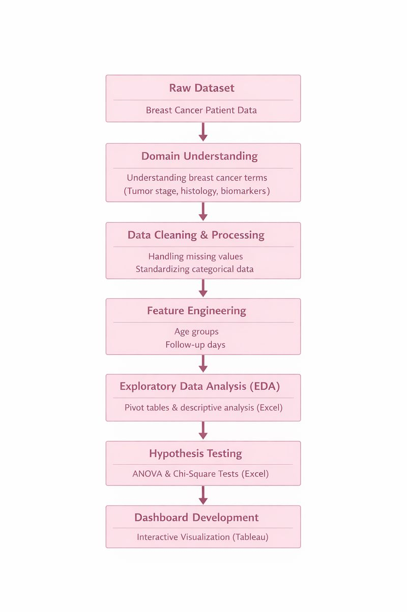
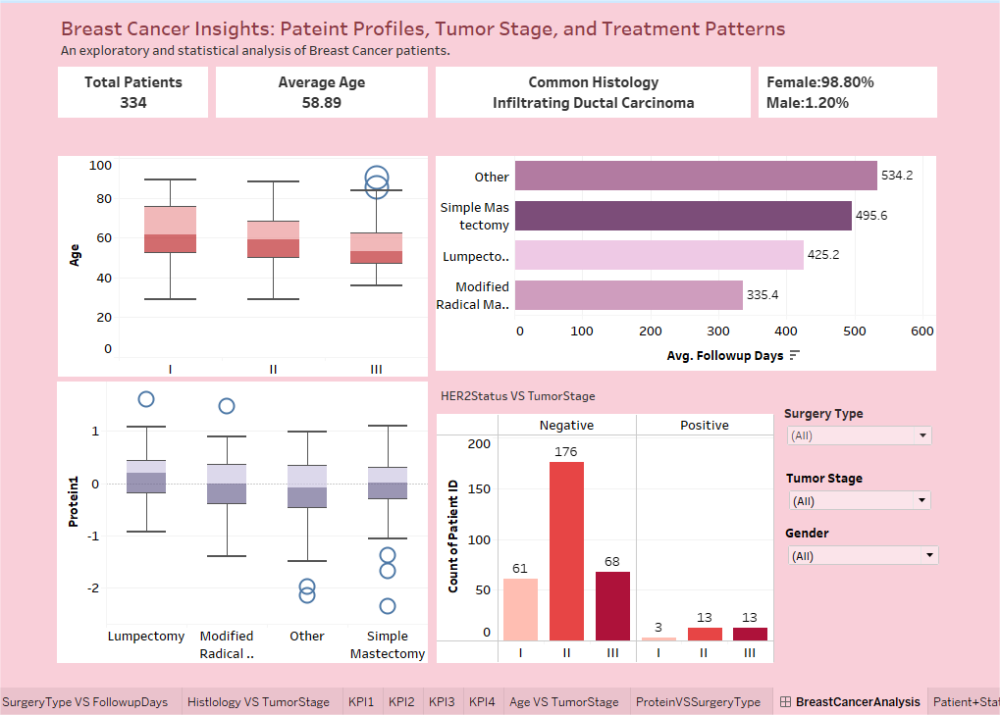

# 🎗 Breast-Cancer-Insights
## 📌 Executive Summary
This project presents an end-to-end data analytics and statistical exploration of breast cancer patient data to identify relationships between patient demographics, tumor characteristics, molecular biomarkers, surgical treatments, and follow-up outcomes.
The analysis combines data cleaning, exploratory data analysis (EDA), hypothesis testing, and interactive dashboards to generate data-driven and clinically meaningful insights.

## 🧩 Problem Statement
Breast cancer outcomes are influenced by multiple interrelated clinical and biological factors.  
The objective of this project is to identify statistically significant associations rather than build predictive models.

### Key Questions Addressed
- Is age associated with tumor stage?
- Do biomarkers (Protein expression, HER2 status) vary across tumor stages or surgery types?
- Is surgery type related to follow-up duration?
- Do gender or histology influence tumor stage or patient status?

## 🔄 Analytics Workflow

## 📂 Dataset Description (Raw dataset downloaded from Kaggle)
- Total Records: 334 patients (after cleaning)
- Granularity: Patient-level clinical data
- Timeframe: Short-term post-surgery follow-up
- Purpose: Statistical analysis and insight generation
  ### Key Variables
        - Demographics: Age, Gender  
        - Clinical: Tumor Stage, Histology, Patient Status  
        - Biomarkers: Protein1–Protein4, ER, PR, HER2  
        - Treatment: Surgery Type  
        - Timeline: Surgery Date, Last Visit Date, Follow-up Days

## 🛠 Methodology

### 1️⃣ Data Cleaning & Feature Engineering
- Standardized categorical fields
- Removed records with no patient information
- Retained clinically valid null values
- Created derived features:
  - Age_Groups
  - Followup_Days

### 2️⃣ Exploratory Data Analysis (EDA)
- Pivot-table-based analysis to understand:
  - Tumor Stage distribution
  - Gender prevalence
  - Patient status overview

### 3️⃣ Statistical Analysis & Hypothesis Testing
- ANOVA for continuous vs categorical relationships
- Chi-Square tests for categorical associations
- Automated summary tables using Excel VBA

### 4️⃣ Visualization & Dashboarding
- Box plots for distribution comparison
- KPI indicators for high-level metrics
- Interactive filters for deeper exploration

## 📊 Dashboard Preview

🔗 **Interactive Tableau Dashboard:**  
https://public.tableau.com/app/profile/sakshi.kamble6871/viz/BreastCancerAnalyticsDashboard_17684046345950/BreastCancerAnalysis

## 📈 Key Findings & Insights
- Average patient age: 58.89 years
- Gender distribution:
  - Female: 98.80%
  - Male: 1.20%
- Patient Status:
  - Alive: 76.35%
  - Dead: 19.76%
  - Unknown: 3.89%
- Most Common Cancer Type: Infiltrating Ductal Carcinoma
- Tumor stage distribution:
  - Stage I: 64 patients
  - Stage II: 189 patients
  - Stage III: 81 patients

### 📶 Statistical Insights (Summary)
- Age is significantly associated with tumor stage
- HER2 status shows significant association with tumor stage
- Protein1 expression varies significantly across surgery types
- Surgery type is associated with follow-up duration
- Gender and histology are not significantly associated with tumor stage

## 💡 Clinical & Analytical Implications
- Age and biomarker indicators play a stronger role in tumor progression than gender
- Treatment type impacts follow-up duration
- Biomarker analysis supports data-driven clinical insights
- Male breast cancer, though rare, remains clinically relevant

## 🧰 Tools & Skills Used
- Excel (Power Query, Pivot Tables, VBA, Statistical Testing)
- Statistics (ANOVA, Chi-Square Test, Hypothesis Testing)
- Tableau (Interactive Dashboard, Box Plots,Bar Charts, KPIs)
- Data Analytics (EDA, Feature Engineering, Insight Communication)

## 🗂️ Project Files
- **BRCA_Raw_Dataset.csv** – Original breast cancer dataset
- **BRCA_Cleaned_Dataset_Testing.xlsm** – Cleaned Dataset (Power Query), EDA pivot tables, and hypothesis testing
- **Breast_Cancer_Analysis.twbx** – Interactive Tableau dashboard
- **Breast_Cancer_Insights_Report.docx** – Detailed analytical report
- **images/** – Dashboard Previews and Analytics Workflow flowchart used in the README.md
Note: The Excel analysis file (BRCA_Cleaned_Dataset_Testing.xlsm) is a macro-enabled (.xlsm) workbook and should be opened in Microsoft Excel with macros enabled.

